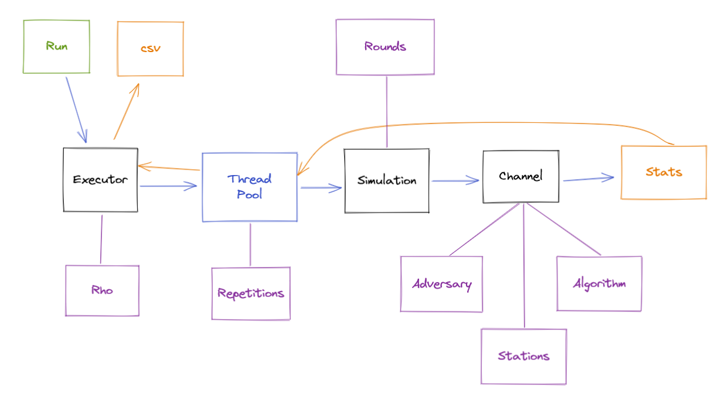

# Multiple Access Channel (MAC)
MAC is a model of the networking problem, where multiple devices (stations) share a transmission medium (channel). As only a single device can successfully transmit at any given time, communication algorithms (protocols) need to resolve potential collisions and maximise throughput.

One of the well-documented and known applications of MAC (medium access control in this case) can be found within the OSI model [https://en.wikipedia.org/wiki/Medium_access_control]. For this case there are already time-based simulations in existence, allowing to approach the problem from the concrete engineering angle.
The current simulation however aims to deal with the more theoretical and abstract form of the model. To start with, MAC is applicable not only to the networking as such -- but to any many-to-one problems (multiple CPUs accessing one message bus, multiple threads accessing a single CPU, group of people talking around the same table).

In this simulation we assume that:
* Time is represented by rounds (we can tick through them)
* System is represented by stations with asynchronous queues connected to the single channel
* Packets are injected by adversary (it is regulated by injection rate and burst)
* Algorithm decides what station transmits in given round
* It should be feasible to run the simulation on 8Gb RAM machine for ~1mln rounds and ~64 stations
* Outcome appears inside the project output folder in csv format

## Technical details

A single simulation consists of the channel with attached stations, adversary, algorithm and statistics collector. The simulation ticks through rounds, while the channel facilitates run within the round: adversary injects packets first, algorithm decides who transmits, transmissions outcome (transmission, collision, silence) are revealed. Due to the performance reasons algorithms are not implemented as fully distributed as they are designed to be (independent runs on stations), but rather as emulating the behavior as close to it as possible for a given algorithm.

Simulations are run in parallel by executors, so that the desired statistical significance can be achieved for randomised algorithms/adversaries. As injection rates represent a key metric for algorithms stability boundaries, by default executors are defined by the range of injection rates. So that given the range and the number of experiment repetitions, for each injection range rho and each repetition a simulation will be created, its stats collected and aggregated. Thread pools are used for simulation repetitions.
To run executors, either Main method with settings.properties is used, or a JUnit test with the predefined configuration.

Practically, the existing implementation was driven by the research on papers described below. We created a separate JUnit test class for each of those publications in separation, for their ease of reading.

## Technical debt
Statistics collection and aggregation is not abstracted away fully, there is a space to move some logic from QueueEnergyExecutor and QueueLatencyExecutor to a generic/common class,

## Contention resolution on a restrained channel
The code of the simulation for the paper "Contention resolution on a restrained channel" by Elijah Hradovich, Marek Klonowski and Dariusz R. Kowalski, appeared in ICPADS 2020
Experiments can be replicated by running tests inside the IcpadsSimulationsSetupTest class.

## New View on Adversarial Queuing on MAC
The code of the simulation for the paper "New View on Adversarial Queuing on MAC" by Elijah Hradovich, Marek Klonowski and Dariusz R. Kowalski, appeared in IEEE Communication Letters 2021
Experiments can be replicated by running tests inside the CLSimulationsSetupTest class.